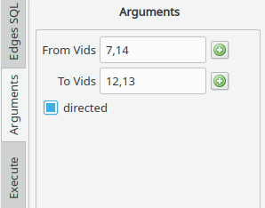

# pgr_dijkstra

- Uses BBOX of the QGIS canvas to limit the resulting path(s)

## Edges SQL tab


## Arguments tab


|Field|Action|
| ----------- | --------- |
|| |
|| |

## Execute tab 


|Button|Action|
| ----------- | --------- |
|| Draws in the canvas the resulting path |
|| Removes from the canvas objects generated with Preview|
|| Creates a one row per edge line geometry layer|
|| Creates a one row per path multiline geometry layer. As many rows as needed|

Depending on the pressed button the layer name will be 
```
(<U|D>) pgr_dijkstra: <source_id>  to <target_id>  BBOX(<bbox>)
(M <U|D>) pgr_dijkstra: <source_id>  to <target_id>  BBOX(<bbox>)
```